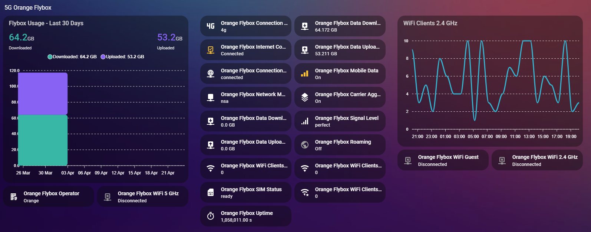

# Orange Flybox — Home Assistant Integration

[](https://github.com/mejmo/hass-flybox-component/releases)
[](https://github.com/hacs/integration)
[](LICENSE)

A Home Assistant custom integration for **Orange Flybox** mobile routers. It polls the router's local API to expose network status, data usage, WiFi state, and battery information as Home Assistant entities.



> **Note:** No authentication is required. The router must be accessible on your local network (default gateway `192.168.2.1`).

---

## Installation

### Via HACS (recommended)

[](https://my.home-assistant.io/redirect/hacs_repository/?owner=mejmo&repository=hass-flybox-component&category=integration)

1. Click the button above, or open HACS → **Integrations** → three-dot menu → **Custom repositories**.
2. Add `https://github.com/mejmo/hass-flybox-component` with category **Integration**.
3. Search for **Orange Flybox** and click **Download**.
4. Restart Home Assistant.

### Manual

1. Download or clone this repository.
2. Copy the `custom_components/flybox` directory into your HA configuration directory:
   ```
   config/custom_components/flybox/
   ```
3. Restart Home Assistant.

---

## Configuration

[](https://my.home-assistant.io/redirect/config_flow_start/?domain=flybox)

1. Click the button above, or go to **Settings → Devices & Services → Add Integration**.
2. Search for **Orange Flybox**.
3. Enter the router's IP address (default: `192.168.2.1`) and the desired polling interval (10–300 seconds, default: 30 s).
4. Click **Submit**. HA will verify connectivity and create the integration.

---

## Features

- Local polling — no cloud dependency
- Auto-discovery of operator name during setup
- All data sourced from the router's built-in REST API
- Full support for HACS

---

## Requirements

- Home Assistant **2023.6.0** or newer
- The Flybox router must be reachable from the HA host (same LAN or routed network)

---

## Entities

### Sensors

| Entity | Description | Unit |
|--------|-------------|------|
| Operator | Mobile network operator name | — |
| Network Mode | Current radio access technology (e.g. `nsa`, `lte`) | — |
| Connection Type | Display type reported by modem (e.g. `4g`, `5g`) | — |
| Signal Level | Signal quality (`poor`, `good`, `great`, `perfect`) | — |
| Connection Status | WAN connection state (`connected` / `disconnected`) | — |
| SIM Status | SIM card state (`ready`, `absent`, …) | — |
| Carrier Aggregation | CA status (`on` / `off`) | — |
| Uptime | Time since last reboot | seconds |
| Data Downloaded | Total downlink data used | GB |
| Data Uploaded | Total uplink data used | GB |
| Data Downloaded (Roaming) | Downlink data used while roaming | GB |
| Data Uploaded (Roaming) | Uplink data used while roaming | GB |
| Battery | Battery charge level | % |
| Battery Charge Status | Charging state (`none`, `charging`, …) | — |
| WiFi Clients 2.4 GHz | Connected clients on the 2.4 GHz network | — |
| WiFi Clients Guest | Connected clients on the guest network | — |
| WiFi Clients 5 GHz | Connected clients on the 5 GHz network | — |

### Binary Sensors

| Entity | Description |
|--------|-------------|
| Internet Connected | `on` when WAN is connected |
| Mobile Data | `on` when mobile data switch is enabled |
| Roaming | `on` when the device is roaming |
| WiFi 2.4 GHz | `on` when the 2.4 GHz access point is active |
| WiFi Guest | `on` when the guest access point is active |
| WiFi 5 GHz | `on` when the 5 GHz access point is active |
| Band Steering | `on` when band steering is enabled |

---

## Debug Logging

Go to **Settings → Devices & Services → Orange Flybox → Enable debug logging**. This toggles debug-level logs for the integration without editing any YAML files.

Each poll cycle will log the complete HTTP conversation — request URL, headers, body, response status, headers, and JSON body — in pretty-printed format. Logs are visible under **Settings → System → Logs**.

---

## Supported Devices

Tested with:

| Device | Firmware |
|--------|----------|
| MeiG Flybox SRT858M 5G | — |

If your device works and is not listed, please open an issue or a PR.

---

## Contributing

Pull requests are welcome. Please open an issue first for any significant change.

---

## License

[MIT](LICENSE)
